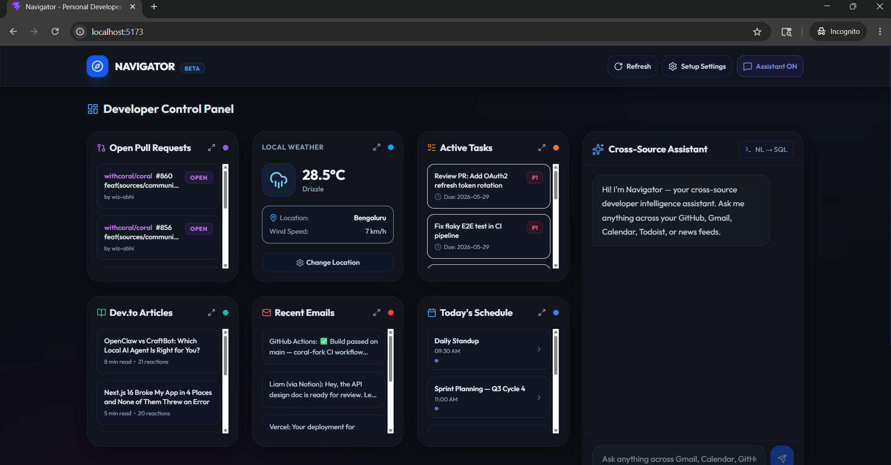

# 🧭 Navigator

> **Your personal developer intelligence dashboard — powered by [Coral](https://github.com/withcoral/coral).**

Navigator aggregates your entire work context — GitHub PRs, Gmail, Google Calendar, Todoist tasks, local weather, and trending dev articles — into a single real-time dashboard with a natural language AI assistant that can query all of it simultaneously.



---

## ✨ Features

| Feature | Description |
|---|---|
| **Unified Dashboard** | 6 live data cards: PRs, Weather, Tasks, Dev.to Articles, Emails, Calendar |
| **NL → SQL Assistant** | Ask anything in plain English — powered by Gemini + Coral's federated SQL engine |
| **Cross-source querying** | One question, 7 sources queried simultaneously |
| **Self-correcting SQL** | Gemini retries with error context if a query fails |
| **Compiled SQL trace** | Every AI answer shows the underlying SQL — no hallucinations |
| **Smart Snooze** | Snooze alerts until your current meeting ends |
| **Weekly Rewind** | AI-generated summary of your week every Monday |
| **"While You Were Away"** | Diff-based summary of what changed since you last opened the app |
| **Day Health Score** | Live score (0–100) based on urgent tasks, unread emails, and meeting load |
| **Weather widget** | Real-time weather via Open-Meteo — no API key needed |
| **One-screen setup** | 90-second onboarding to connect all your tools |

---

## 🏗️ Architecture

```
┌─────────────────────────────────────────────────────────────────┐
│                       NAVIGATOR UI                              │
│   React + Vite + TailwindCSS + Glassmorphism Design System      │
│                                                                 │
│  ┌─────────────────────┐   ┌───────────────────────────────┐   │
│  │   Dashboard Cards   │   │   NL Assistant (NLQuery.jsx)  │   │
│  │  PRs · Weather ·    │   │  Prompt → Gemini → SQL →      │   │
│  │  Tasks · Articles   │   │  Coral → Answer               │   │
│  │  Emails · Calendar  │   └───────────────────────────────┘   │
│  └─────────────────────┘                                        │
└────────────────────────────┬────────────────────────────────────┘
                             │ HTTP (localhost:8000)
┌────────────────────────────▼────────────────────────────────────┐
│              FastAPI Backend  (navigator/backend/)               │
│                                                                 │
│  /api/focus  /api/health  /api/sql  /api/query                  │
│  /api/rewind  /api/snooze  /api/summary  /api/github/pulls      │
└────────────────────────────┬────────────────────────────────────┘
                             │
┌────────────────────────────▼────────────────────────────────────┐
│                    CORAL  (Data Federation)                      │
│                                                                 │
│  github.pulls  │  gmail.threads  │  google_calendar.events      │
│  todoist.tasks │  open_meteo.forecast  │  devto.articles        │
│  hn.stories    │  ...extensible via Coral source catalog        │
└─────────────────────────────────────────────────────────────────┘
```

---

## 🚀 Quick Start

### Prerequisites

- [Rust + Cargo](https://rustup.rs/) (for Coral CLI)
- Python 3.11+
- Node.js 18+
- A [Gemini API key](https://aistudio.google.com/)

### 1. Install Coral CLI

```bash
# macOS / Linux
curl -sSfL https://coral.sh/install | sh

# Or build from source in this repo
cargo build --release -p coral-cli
```

### 2. Start the Backend

```bash
cd navigator
pip install -r requirements.txt
python backend/main.py
```

The API server starts on `http://localhost:8000`.

### 3. Start the Frontend

```bash
cd navigator/frontend
npm install
npm run dev
```

Open `http://localhost:5173` in your browser.

### 4. Configure Navigator

On first launch, the setup page will appear. Fill in your API tokens:

| Token | Where to get it |
|---|---|
| **Gemini API Key** *(required)* | [aistudio.google.com](https://aistudio.google.com) |
| **GitHub Token** | [github.com/settings/tokens](https://github.com/settings/tokens) — `repo` scope |
| **Todoist Token** | [todoist.com/app/settings/integrations/developer](https://todoist.com/app/settings/integrations/developer) |
| **Google OAuth** | See [Google OAuth Setup](#google-oauth-setup) below |
| **Telegram Bot Token** *(optional)* | [@BotFather](https://t.me/BotFather) |

---

## 🔐 Google OAuth Setup

Navigator needs Gmail and Google Calendar access via OAuth refresh tokens.

1. Go to [Google Cloud Console](https://console.cloud.google.com/) → create a project → enable **Gmail API** and **Google Calendar API**
2. Configure an OAuth consent screen (External). Add scopes:
   - `https://www.googleapis.com/auth/gmail.readonly`
   - `https://www.googleapis.com/auth/calendar.readonly`
3. Create **OAuth 2.0 Client ID** → Web Application. Add `https://developers.google.com/oauthplayground` as an authorized redirect URI
4. Open [Google OAuth Playground](https://developers.google.com/oauthplayground):
   - Click the ⚙️ settings icon → check **"Use your own OAuth credentials"** → paste your Client ID and Secret
   - Authorize both scopes → exchange the code → copy the **Refresh Token**
5. Paste the Client ID, Client Secret, and Refresh Token into Navigator's setup page

---

## 💬 Assistant Demo Prompts

Once configured, try these in the NL Assistant panel:

```
What should I work on today?
Do I have any urgent tasks due soon?
What meetings do I have today?
Any unread emails from my team?
Summarize my open pull requests
What's the weather like right now?
Show me trending articles from Dev.to
Plan my afternoon based on my calendar
```

Every response shows the **compiled SQL trace** underneath — you can see exactly which source was queried and how.

---

## 📁 Project Structure

```
navigator/
├── backend/
│   ├── main.py              # FastAPI app — all API endpoints
│   ├── coral_client.py      # Coral CLI wrapper + query execution
│   ├── gemini_service.py    # Gemini NL→SQL translation + synthesis
│   └── bot.py               # Telegram bot adapter
├── frontend/
│   ├── src/
│   │   ├── App.jsx           # Root layout, routing, shared state
│   │   ├── components/
│   │   │   ├── Dashboard.jsx # All 6 data cards + expanded modal
│   │   │   ├── NLQuery.jsx   # Chat assistant panel
│   │   │   ├── MetricsBar.jsx # Bottom status bar
│   │   │   └── Onboarding.jsx # One-screen setup form
│   │   └── index.css         # Design system, glassmorphism tokens
│   └── package.json
└── .env                      # Your credentials (never committed)
```

---

## 🔌 Data Sources

Navigator uses Coral to query these sources via SQL:

| Source | Data | Coral Table |
|---|---|---|
| GitHub | Open PRs authored by you | `github.pulls` |
| Gmail | Inbox threads + unread count | `gmail.threads`, `gmail.messages` |
| Google Calendar | Today's events | `google_calendar.events` |
| Todoist | Active tasks with priority | `todoist.tasks` |
| Open-Meteo | Current weather | `open_meteo.forecast` |
| Dev.to | Trending & rising articles | `devto.articles` |
| Hacker News | Top stories | `hn.stories` |

---

## 🧩 Extensibility

Because Navigator is built on Coral's federated SQL engine, adding a new data source is as simple as:

1. Adding a Coral source spec (YAML) for the new API
2. Querying it with SQL in the backend
3. Rendering a new card in the Dashboard

The Coral community source catalog has 50+ sources. Any of them can be wired into Navigator with minimal code.

---

## 🛡️ Privacy & Security

- **All data stays local.** Navigator runs entirely on your machine — no cloud sync, no third-party servers.
- **Credentials stored in `.env`** — never committed to git (`.gitignore` covers it).
- **Tokens are write-protected** — the frontend never reads tokens back from localStorage after initial setup.

---

## 🤝 Contributing

This project lives in the [coral-fork](https://github.com/wiz-abhi/coral-fork) monorepo under `navigator/`.

1. Fork the repo
2. `cd navigator/frontend && npm run dev` for UI work
3. `cd navigator && python backend/main.py` for backend work
4. UI changes: run `npm run check --prefix ui` before PR
5. Backend changes: follow [AGENTS.md](../../AGENTS.md) guidelines

---

## 📄 License

MIT — see [LICENSE](../../LICENSE).

---

*Built with ❤️ on top of [Coral](https://github.com/withcoral/coral) · Powered by Gemini · React · FastAPI*
